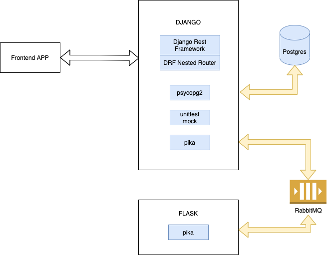

# DJANGO CODE CHALLENGE

This repository contains code that represents simple restful web API with DJANGO.


# Table of Contents
1. [Getting Started](#getting_started)
2. [Built With](#built_with)
3. [Estimated Learning/ Implementing Time](#estimated_learning)
4. [Authors](#authors)
5. [Environment File](#environment_file)
6. [Sample Result](#sample_result)
7. [Host Solution on Heroku ](#on_heroku)
8. [Unit Test with Mock](#unit_test)
9. [Message Queue RabbitMQ with Pika](#message_queue)


## Getting Started <a name="getting_started"/>

These repo will get you an idea how to create a simple restful web API with DJANGO. We will walkthrough packages required, code behind how this works, and how all pieces connected together.

Overall Architecture:




<a name="built_with"/>
## Built With

This project makes sure we have used the following packages and versions:

    ```python
        "packages": {
            django = "===3.0.4",
            djangorestframework = "==3.11",
            drf-nested-routers = "0.93.4",
            psycopg2 = "==2.8.6",
            mock = "==4.0.3", # unit test
            pika = "==1.2.0"  # message queue (rabbitmq)
		}
    ```


<a name="estimated_learning"/>
## Estimated Learning/ Implementing Time

This project will use a simple and useful packages; but it would still be a good idea to log how much time I have learn and implement this so that you may be able to follow in later stage:

| Topic | Time (hr) | 
| :---: | :---: | 
| POSTGRES | 1 | 
| DJANGO with PIPENV setup | 1 | 
| Building models and migrations  | 1 | 
| Implementing DJANGO Rest Framework & DRF Nested Router  | 1 | 
| Host solution on Heroku | 2 | 
| Unit test with Mock  | 2 | 
| Search and Filter  | 0.5 | 
| Simple Message Queue demonstration  | 1.5 | 


<a name="authors"/>
## Authors

 [Pongsak](misc/pongsaks_cv.pdf) is a technical leader who has a great passion in technology; he has been working with industries to enable digital platform and manage project delivery; although currently working in project management, [Pongsak](misc/pongsaks_cv.pdf) loves coding and never stop learning technology in depth; [Pongsak](misc/pongsaks_cv.pdf) is looking for assignments with hands-on coding / implementing; find out more in my resume at [Pongsak](misc/pongsaks_cv.pdf)


<a name="environment_file"/>
## Environment File

The environment file .env has been setup as below. Database name will be DBNAMEPREFIX + STATE so that it will get correctly move to different development state.

    ```
        STATE=development
        DBNAMEPREFIX=testchallenge_
        DBUSER=[YOUR DB USER]
        DBPASSWORD=[YOUR DB PASSWORD]
        DBHOST=[YOUR DB HOST]
        DBPORT=[YOUR DB PORT]
    ```

We can place .env file in the main folder:

    ```
        
        .
        ├── README.md
        ├── misc
        │  └── pongsaks_cv.pdf
        ├── src
        │  ├── django_main
        │  │  ├── Pipfile
        │  │  ├── Pipfile.lock
        │  │  ├── django_main
        │  │  │  ├── __init__.py
        │  │  │  ├── asgi.py
        │  │  │  ├── settings.py
        │  │  │  ├── urls.py
        │  │  │  └── wsgi.py
        │  │  ├── justapp
        │  │  │  ├── __init__.py
        │  │  │  ├── admin.py
        │  │  │  ├── apps.py
        │  │  │  ├── migrations
        │  │  │  │  ├── 0001_initial.py
        │  │  │  │  ├── 0002_auto_20211026_1439.py
        │  │  │  │  └── __init__.py
        │  │  │  ├── models.py
        │  │  │  ├── serializers.py
        │  │  │  ├── services.py
        │  │  │  ├── tests.py
        │  │  │  └── views.py
        │  │  └── manage.py
        │  └── flask_micro_service1
        │      ├── Pipfile
        │      ├── Pipfile.lock
        │      ├── app.py
        │      └── channel_wrapper.py
        └── writeups
            ├── api.drawio
            └── api.drawio.png

    ```


<a name="sample_result"/>
## Sample Result

### Students Endpoint

    ``` http://127.0.0.1:8000/students/

        HTTP 200 OK
        Allow: GET, POST
        Content-Type: application/json
        Vary: Accept

        [
            {
                "pk": "BBFAP5Z0FIM1RAV2SV5U",
                "firstname": "Pongsak",
                "lastname": "S",
                "studentid": "BBFAP5Z0FIM1RAV2SV5U",
                "created": "2021-10-24",
                "school": 2
            },
            {
                "pk": "BS7BZFXIVMBV4LOVEOKI",
                "firstname": "Pongsak2",
                "lastname": "S",
                "studentid": "BS7BZFXIVMBV4LOVEOKI",
                "created": "2021-10-24",
                "school": 2
            },
            {
                "pk": "JY5NJLFBHEJ86ZNYUMSM",
                "firstname": "Pongsak3",
                "lastname": "S",
                "studentid": "JY5NJLFBHEJ86ZNYUMSM",
                "created": "2021-10-24",
                "school": 1
            }
        ]

    ```


### Schools Endpoint

    ``` http://127.0.0.1:8000/schools/

            HTTP 200 OK
            Allow: GET, POST, HEAD, OPTIONS
            Content-Type: application/json
            Vary: Accept

            [
                {
                    "pk": 1,
                    "name": "MIT",
                    "max_students": 5,
                    "created": "2021-10-24"
                },
                {
                    "pk": 2,
                    "name": "Chula",
                    "max_students": 2,
                    "created": "2021-10-24"
                }
            ]

    ```

### Nested Endpoint

    ``` http://127.0.0.1:8000/schools/2/students/BS7BZFXIVMBV4LOVEOKI/
    
            HTTP 200 OK
            Allow: GET, PUT, DELETE
            Content-Type: application/json
            Vary: Accept

            {
                "pk": "BS7BZFXIVMBV4LOVEOKI",
                "firstname": "Pongsak2",
                "lastname": "S",
                "studentid": "BS7BZFXIVMBV4LOVEOKI",
                "created": "2021-10-24",
                "school": 2
            }

    ```

### Validation Maximum Student Reach

    ``` http://127.0.0.1:8000/students/
    
            HTTP 400 Bad Request
            Allow: GET, POST
            Content-Type: application/json
            Vary: Accept

            {
                "school": [
                    "maximum number of student reached"
                ]
            }

    ```

### Search and Ordering Filter

    ``` http://127.0.0.1:8000/students/?search=jane&ordering=age
    
            HTTP 200 OK
            Allow: GET, POST
            Content-Type: application/json
            Vary: Accept

            [
                {
                    "pk": "3AFP89MBBFCI195TJF62",
                    "firstname": "Jane",
                    "lastname": "Test2",
                    "studentid": "3AFP89MBBFCI195TJF62",
                    "created": "2021-10-26",
                    "school": 3,
                    "age": 1,
                    "nationality": "Nepali"
                },
                {
                    "pk": "QY78X8479FY7RPAPHCD9",
                    "firstname": "Jane",
                    "lastname": "Mana",
                    "studentid": "QY78X8479FY7RPAPHCD9",
                    "created": "2021-10-26",
                    "school": 3,
                    "age": 5,
                    "nationality": "English"
                },
                {
                    "pk": "VRYLPZAUG7QULF669KPH",
                    "firstname": "Jane",
                    "lastname": "Pongsak",
                    "studentid": "VRYLPZAUG7QULF669KPH",
                    "created": "2021-10-26",
                    "school": 3,
                    "age": 20,
                    "nationality": "Japanese"
                }
            ]

    ```


<a name="on_heroku"/>
## Host Solution on Heroku 

[django-main-app.herokuapp.com/schools](https://django-main-app.herokuapp.com/schools) </br>
[django-main-app.herokuapp.com/students](https://django-main-app.herokuapp.com/students) </br>
[django-main-app.herokuapp.com/schools/4/students](https://django-main-app.herokuapp.com/schools/4/students) </br>

[django-main-app.herokuapp.com/students/?search=jane](https://django-main-app.herokuapp.com/students/?search=jane) </br>
[django-main-app.herokuapp.com/schools/4/students/?search=jane&ordering=age](https://django-main-app.herokuapp.com/schools/4/students/?search=jane&ordering=age) </br>


<a name="unit_test"/>
## Unit Test with Mock()

This module has implemented Django TestCase with Mock. In this case, we can inject behaviour of models Student and School so that we can test and validate helper functions (i.e. unique_rand, is_not_reach_max_students).


Code: 

    ``` djang_codechallenge/src/justapp/tests.py
    
        @patch('justapp.models.Student') # injecting student mock -> mocked_student
        def test_unique_rand(self, mocked_student):
            """unique_rand helper can run correctly"""
            # mocking queryset
            mocked_queryset = Mock()
            mocked_queryset.exists.return_value = False
            # injecting mocked_queryset into mocked_student
            mocked_student.objects.filter.return_value = mocked_queryset
            # 1) validate output is 20 chars
            self.assertEqual(len(unique_rand()),20)
            # 2) validate student filter has been called
            mocked_student.objects.filter.assert_called_once() 

        
        @patch('justapp.models.Student') # injecting student mock -> mocked_student
        def test_is_not_reach_max_students(self, mocked_student):
            """is_not_reach_max_students helpers shall raise error if reaching max students"""
            # mocked school object
            mocked_school = Mock(spec=School)
            mocked_school.max_students = 2
            # mocking queryset
            mocked_queryset = Mock()
            mocked_queryset.count.return_value = 2
            # injecting mocked_queryset into mocked_student
            mocked_student.objects.filter.return_value = mocked_queryset
            self.assertRaises(ValidationError,is_not_reach_max_students, mocked_school)
            mocked_student.objects.filter.assert_called_once() 

    ```

Result: 

    ``` python manage.py test
    
        Creating test database for alias 'default'...
        System check identified no issues (0 silenced).
        ..
        ----------------------------------------------------------------------
        Ran 2 tests in 0.006s

        OK

    ```


<a name="message_queue"/>
## Message Queue RabbitMQ with Pika

This module has implemented to use RabbitMQ (via Pika) to connect between Django and Flask servers.

Sample Result: 


    ``` http://127.0.0.1:8000/service1
    
        {"message": "submit to queue successfully!"}

    ```


    ``` http://127.0.0.1:8000/service1
    
         [*] Waiting for queue messages.
         [x] MQ Received {'phone': '+66-92-123-4567', 'message': 'mocking message'}

    ```

